# Background 

IMDb (Internet Movie Database) is one of the world's most popular sources for movie, TV show, video game, and celebrity content. It contains information such as cast members, plot summaries, gross earnings, critic reviews and much more. For any media fan, IMDb is a great source to research your favorite entertainment listings. 

This report displays information such as gross earnings, ratings, votes, and runtime for various movies, and highlights differences between popular genres. Its goal is to suggest that some genres are more popular than others, and is reflected in various movie characteristis such as gross earnings and ratings.

# Visualization and Interpretations

## Wordcloud  

### The word cloud images were generated from the titles of movies in each genre. Titles were splited into words. Then, stopwords and rare characters were removed using regular expression pattern matching techniques. The frequencies of words were fed to wordcloud2 function to generate each plot.  

  Action Movies: Words associated with actions actually occur more as expected(boxer, attack, breaking, broken, kickboxer). Some Japanese words appear (gekij, jigoku, kenju), which is interesting.
    
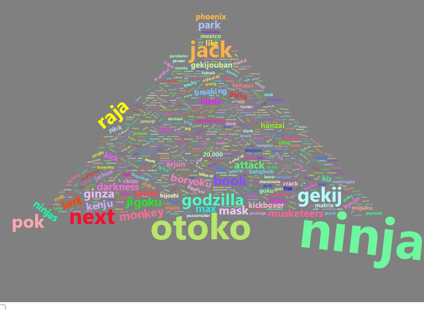
  
 Animation Movies: Gekijouban and gekij--special movie versions for TV series--appear a lot more than other words. Japanese animations are well-known and well rated. Not Surprised. 
 
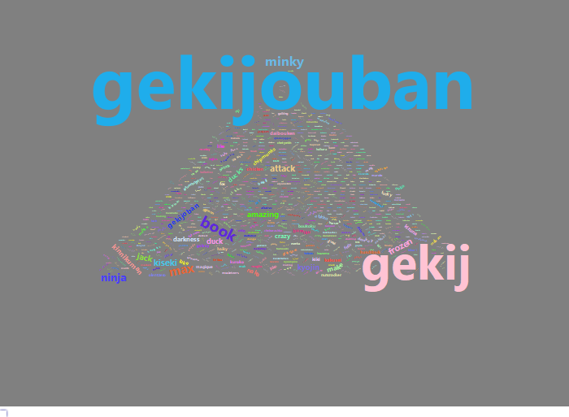
  
  
   Biography Movies: Person names and events occur more than others. For example, we see Elizabeth, Alexander, Frank, and Auschwitz which refers to the concentration camp in Poland.  
   
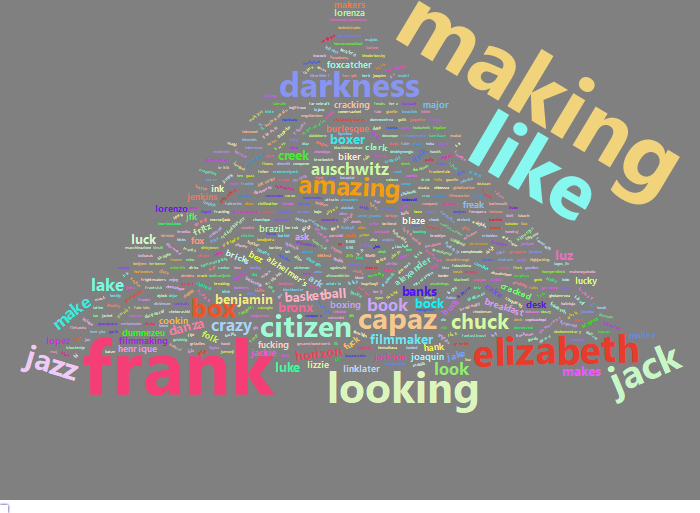  

   
   Comedy movies: words such as like, jack, lucky are associated with commedy, but ninja is a strange word here.  
   
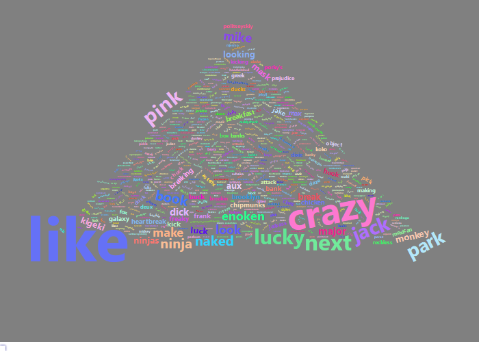  
 Crime Movies: Besides darkness, darkest, Japaneses words like jigok, kenju; and places including Brooklyn and ginza(one of top shopping district in Tokyo) also appear in titles a lot.  
 
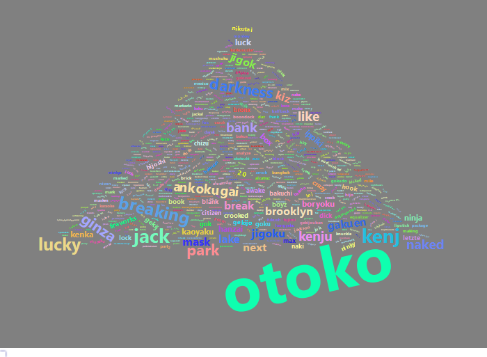  
  Drama Movies: The word usage is rather common. No particular patterns can be pointed out.  
  
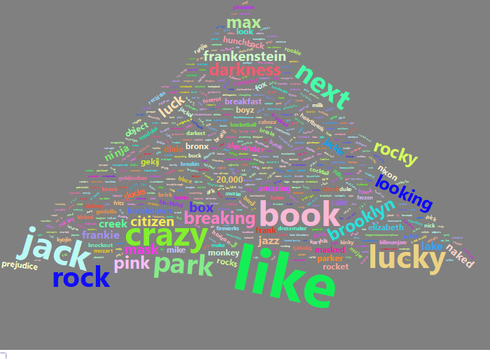  

  Fantacy Movies: Godzilla, Frankenstein, ninja occur more often than others.  
  
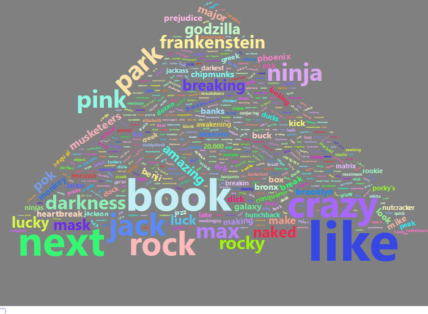  

  Histroy Movies: Similar to Biography, there are some overlaps: auschwitz, elizabeth, alexander, conquest. The reason could be that many movies are categorized into multiple genres.  
  
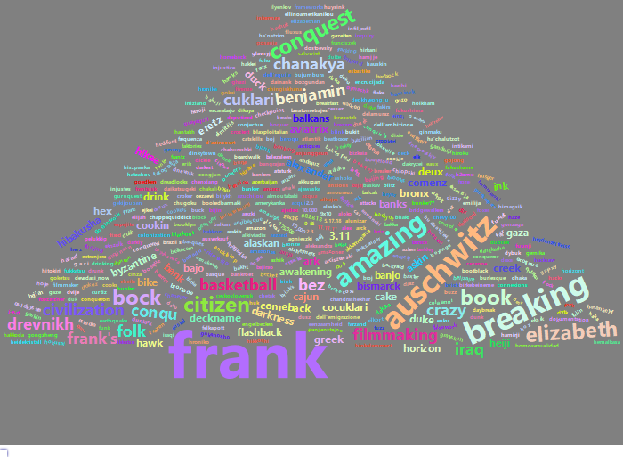  

  Horror Movies:  
  
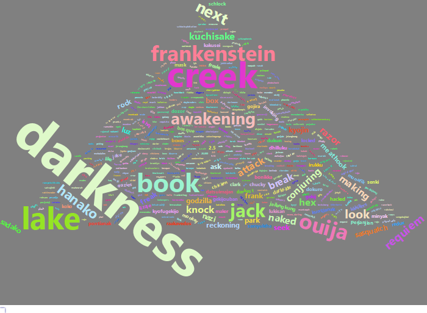  

  Romance movies:  
  
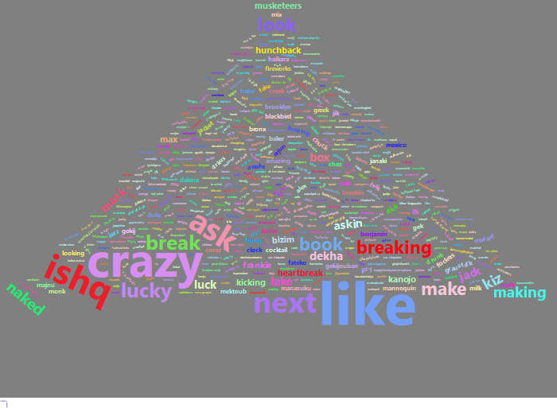

  Sci-Fi:  
  
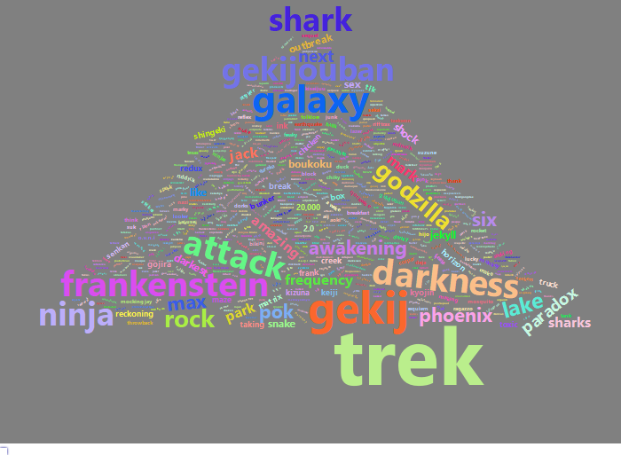  


  War Movies: Bunker, Auschwitz, flashback are related to wars. 
  

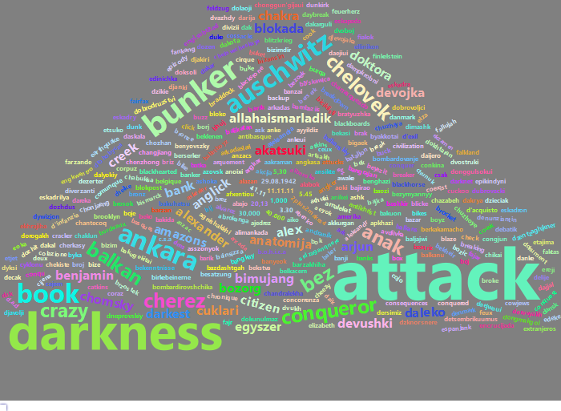  

### Overall, most of the results given by the wordcloud met our expectations, but there are rare words that appear frequently and some very common word that appear in many genres. The visualizations are interesting, but they only provide infomation at the surface.


## ggplot
```{r,echo=F,include=T}
options(warn=-1)
load("plot_data/ggplot.RData")
```
  
  - The boxplot below shows the interquartile range of earned grosses for each genre of movie. For each movie, the top 100 grosses were selected and plotted. Fantasy, Action, and Sci-Fi appear to be the frontrunners while War, Horror, Biographies and History generate less revenue on average.
```{r,echo=F,include=T,fig.width=13,fig.height=9,fig.align='center',message=F}
options(warn=-1)
ggplot_list[[2]][[1]]
```
  
  - The bar plots below show the counts of movies by genre for each movie rating (or certificate). Important to notice that the majority of all movies fall under the ratings of G, PG, PG-13, and R. Horror and War have the highest counts of R rated movies, Thrillers and Action have the highest numbers of PG-13 movies, Animations have the highest number of PG movies, and Musicals have the highest number of G rated movies.
```{r,echo=F,include=T,fig.width=13,fig.height=9,fig.align='center',message=F}
options(warn=-1)
ggplot_list[[2]][[2]]

```
  
  - The histogram below shows the counts movies with specfic runtimes for each genre. The histograms suggest that Comedy and Animation are traditionally less than 100 minutes, and Sci-Fi and History movies tend to be on the longer side. 
```{r,echo=F,include=T,fig.width=13,fig.height=9,fig.align='center',message=F}
options(warn=-1)
ggplot_list[[2]][[3]]

```
  
  - The boxplot below shows the interquartile range of rating score of each movie determined by the votes of viewers. The horizontal dashed line represents the mean rating score for all movies. The boxplots suggest that Drama films generally receive the highest ratings, while horror movies receive the lowest ratings.  
```{r,echo=F,include=T,fig.width=13,fig.height=9,fig.align='center',message=F}
options(warn=-1)
ggplot_list[[2]][[4]]

```


## gganimate
```{r,echo=F,include=T,fig.width=15,fig.height=9,message=F}
options(warn=-1)
load("plot_data/animation.RData")
```
  
  - We used gganimate package to generate some graphical animations.Racing bar graph or Bar chart race  has been growing in popularity since the start of this year.We tried to emulate the same visualization with the data  we scrapped.The racing bar graph shows the movies produced per year and ranks highest genre of movie at the top.
```{r,echo=F,cache=T,message=F}
options(warn=-1)
moving_animation
```

  - The other animation represents bar chart race in a different way. We did it using plotly package. The animation allows the user to control the number of years on the x axis, and observe the corresponding effects of movie counts by genre.
```{r,echo=F,cache=T,message=F}
options(warn=-1)
movie_per_year
```
```{r,echo=F,cache=T,message=F}
options(warn=-1)
trend_of_movies
```
  
  - The third animation is the moving curve of four randomly selected genre of movies. The animation displays the number of movies over time as an increasing/decreasing line for each genre.   hrbthemes and viridis package were used for this animation.